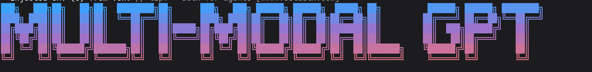

# Multi-Model Backend

> A terminal-first multi-model assistant that generates three candidate answers, evaluates them, and returns the strongest response.

  

    
  

## At A Glance

- `CLI-based` backend application
- Multi-model generation with a separate evaluator
- Structured JSON responses for consistent output
- Terminal styling with `figlet`, `chalk`, `gradient-string`, and `boxen`

## How It Works

1. The app starts from `engine.js`.
2. It loads secrets and provider URLs from `.env`.
3. It opens a terminal prompt using `readline/promises`.
4. For each user message, it sends the same prompt to three models:
   - Gemini
   - Groq-hosted Llama
   - Groq-hosted GPT OSS
5. Each model returns a structured response with:
   - a short title
   - a brief explanation
   - a small example
6. The three answers are passed into a separate evaluator.
7. The evaluator scores each response out of 10 with unique ratings.
8. The best-scoring answer is printed in the terminal.

The conversation history is kept in memory through `Messages_DB`, so the app can continue context across turns.

## Interface

This project is **CLI-based**, not UI-based.

It runs entirely in the terminal and does not use a browser or front-end framework.

## Models And Providers

The code uses the OpenAI SDK with OpenAI-compatible provider endpoints.

### Providers

- **Gemini provider**
  - Configured with `GOOGLE_API`
  - Uses `GOOGLE_URL`

- **Groq provider**
  - Configured with `GROQ_API`
  - Uses `GROQ_URL`

### Models

- `gemini-3.5-flash`
  - Used for one generation pass

- `meta-llama/llama-4-scout-17b-16e-instruct`
  - Used for one generation pass
  - Also used as the evaluator model

- `openai/gpt-oss-20b`
  - Used for one generation pass

## Self-Consistency Flow

The self-consistency flow lives in `engine.js` and follows a simple generate -> compare -> select pattern.

1. The user enters a prompt.
2. The prompt is sent to three model functions:
   - `getResponseFromGemini()`
   - `getResponseFromGroq()`
   - `getResponseFromGPT()`
3. Each model response is parsed against the `inputStructure` schema.
4. The three responses are passed to `evaluation()`.
5. `evaluation()` sends the candidate answers to the evaluator prompt.
6. The evaluator returns a score for each model.
7. The code picks the answer with the highest score.
8. That answer is shown as the final output in the terminal.

## Files

- `engine.js` contains the full implementation
- `package.json` lists runtime dependencies
- `.env` stores API keys and base URLs

## Environment Variables

The app expects values similar to these in `.env`:

- `GOOGLE_API`
- `GOOGLE_URL`
- `GROQ_API`
- `GROQ_URL`

## Notes

- Type `exit` or `quit` to leave the app.
- The evaluator is intentionally strict and uses unique scores so only one winner is selected.
- To add the real screenshot later, replace `./assets/screenshot-1.png` with your image file.
